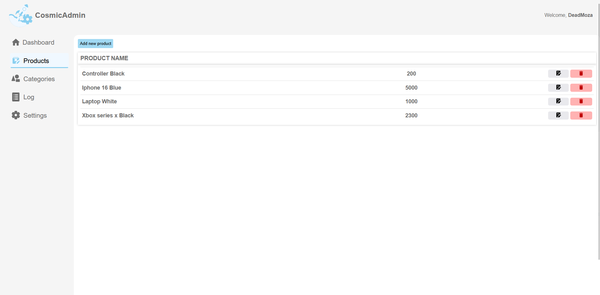
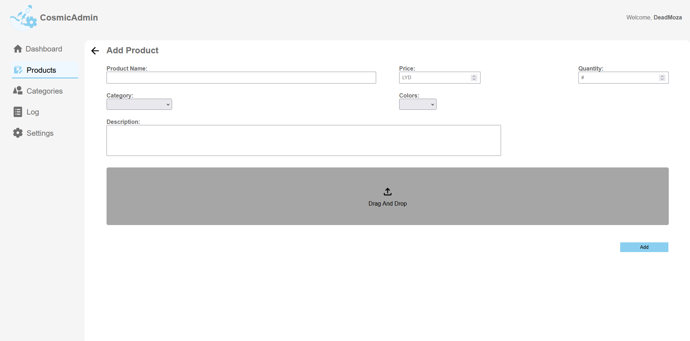
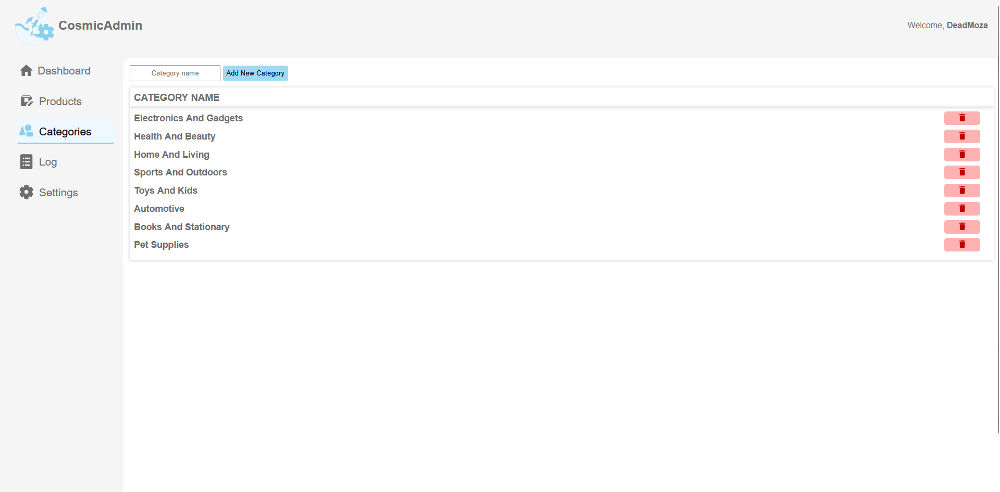

# Cosmic Store Dashbaord.

Made with:

**This is a back-end manager for the *Cosmic Store* front-end eccommerce web app**.

1. Check business profits, orders, and refunds through the main dashboard.
2. View all avilable products in the store-front with the ability to hide, edit, and or delete selected products.

3. The ability to alter the store-front's categories to influence searching and filtering in the front-end store.

4. View and manage all previous orders through the audit log.
5. Create new users and change the featured items on the front end.

MIT License.